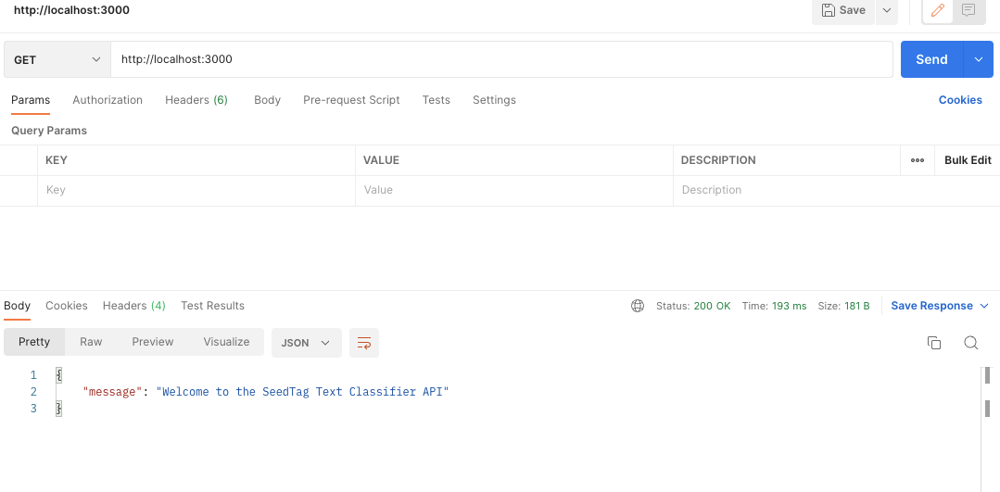
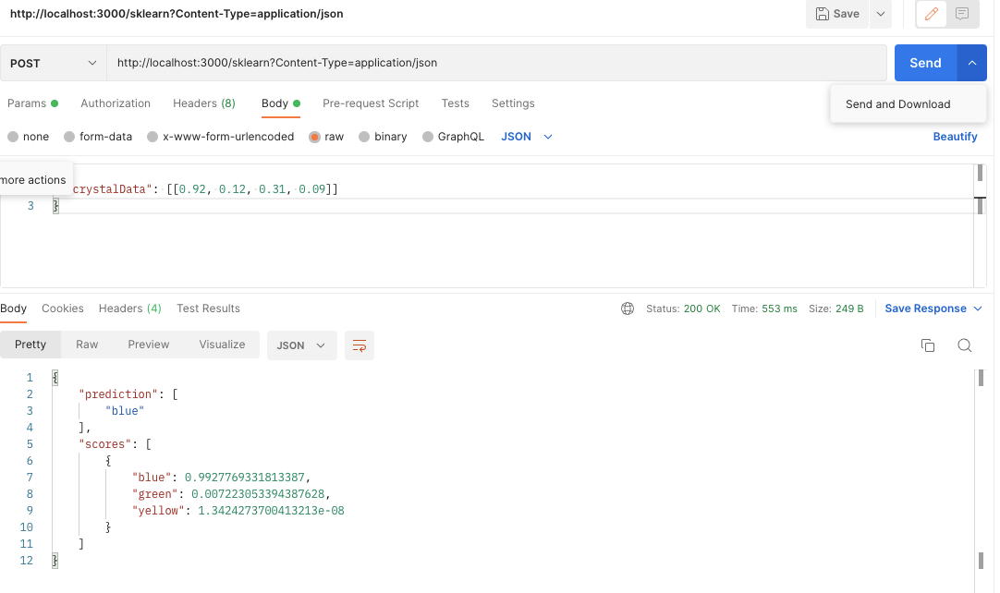
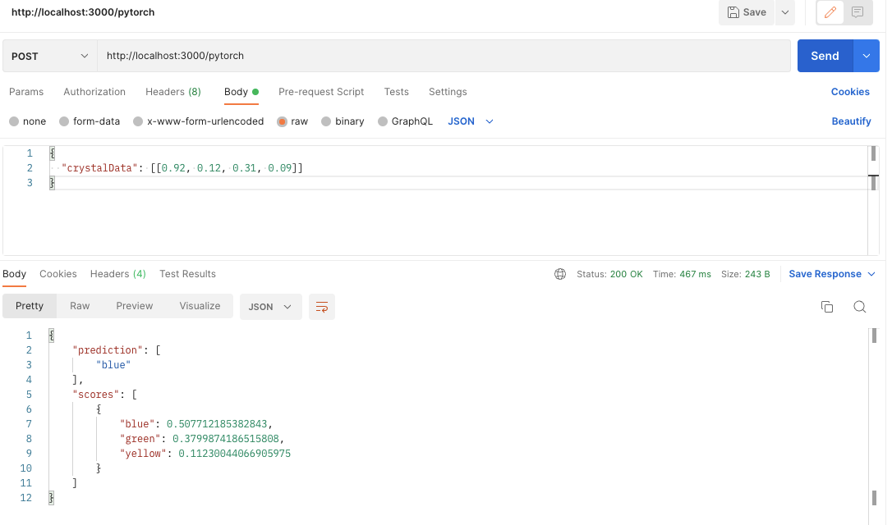
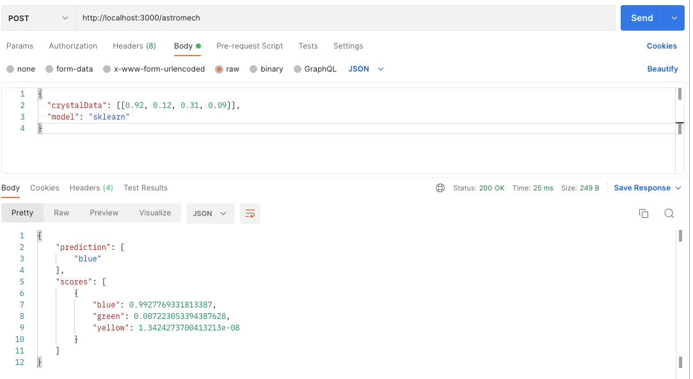
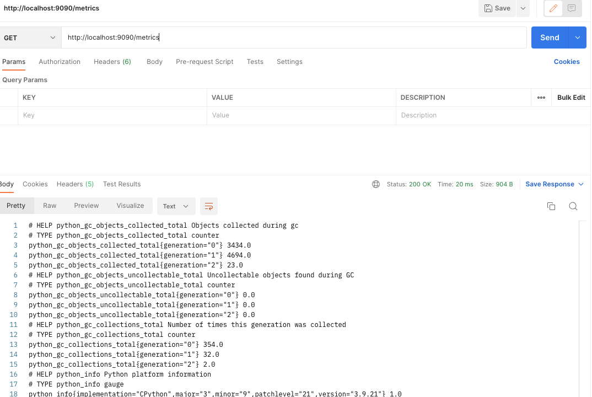

# SOLUTION.md

## Overview

This document provides a detailed explanation of the steps taken to resolve the issues related to deploying Scikit-Learn and PyTorch models using a FastAPI application. It also covers the testing strategies implemented to ensure the functionality and reliability of the application.

## Problem Statement

The primary goal was to deploy machine learning models (Scikit-Learn and PyTorch) using a FastAPI application. The application needed to handle predictions from both models and provide appropriate responses. Additionally, the application required proper validation, error handling, and testing to ensure robustness.

## Steps Taken to Resolve Issues

### 1. FastAPI Application Setup

- **Initialization**: A FastAPI application was initialized to serve as the backend for handling predictions.
- **Model Loading**: The Scikit-Learn and PyTorch models were loaded using their respective libraries (`joblib` for Scikit-Learn and `torch` for PyTorch).
- **Endpoint Definition**: Three endpoints were defined:
  - `/sklearn`: For making predictions using the Scikit-Learn model.
  - `/pytorch`: For making predictions using the PyTorch model.
  - `/astromech`: For making predictions using either model based on the input.

In the following screenshots see a few examples of the real execution:

- **Get Home Page**:

- **sklearn**:

- **pytorch**:

- **astromech**:

### 2. Input Validation

- **Pydantic Models**: Pydantic models were used to validate the input data. The `CrystalData` model ensured that the input data contained a list of lists, each with exactly four floats.
- **Custom Validation**: For the `/astromech` endpoint, custom validation was added to check the validity of the `model` field. If the model type was invalid, a 400 Bad Request error was raised.

### 3. Error Handling

- **Validation Errors**: Validation errors were handled using Pydantic's `ValidationError`. If the input data did not meet the required format, a 422 Unprocessable Entity error was returned.
- **General Errors**: General exceptions were caught and returned as 500 Internal Server Error responses to ensure that unexpected issues were properly reported.

### 4. OpenAPI Specification

- **YAML Specification**: An OpenAPI specification was defined in a `prediction-openapi.yaml` file. This file described the API endpoints, request bodies, and responses.
- **Custom OpenAPI Schema**: The FastAPI application was configured to load the OpenAPI schema from the YAML file, ensuring that the API documentation was accurate and up-to-date.

### 5. Docker and Kubernetes Deployment

- **Docker Configuration**: Docker was used to containerize the FastAPI application. A `Dockerfile` and `docker-compose.yml` file were created to build and run the application in a containerized environment.
- **Kubernetes Deployment**: Kubernetes manifests (`deployment.yaml` and `service.yaml`) were created to deploy the application to a Kubernetes cluster. The `Makefile` was updated to include targets for building, pushing, and deploying the Docker images.
- **Namespace and Label Selector**: The Kubernetes deployment was configured to use a specific namespace and label selector to manage the pods effectively.
- **Port Forwarding**: A `port-forward` target was added to the `Makefile` to set up port forwarding to the pod, allowing access to the application from the local machine.

### 6. Prometheus Integration

- **Metrics Collection**: Prometheus was integrated to collect metrics from the FastAPI application. The `prometheus_client` library was used to create metrics for tracking request processing time and the total number of requests.
- **Metrics Endpoint**: An endpoint `/metrics` was added to expose the Prometheus metrics.
- **Prometheus Server**: A Prometheus server was started to expose the metrics on port 9090.

In the following image see the real execution with postman:

### 7. Testing

- **Unit Tests**: Unit tests were written using `pytest` to ensure the functionality of the endpoints. The tests covered various scenarios, including successful predictions, validation errors, and invalid model types.
- **TestClient**: FastAPI's `TestClient` was used to run the tests without needing to start the server, making the tests faster and more isolated.
- **Makefile Integration**: The `Makefile` was updated to include a `test` target, allowing tests to be run easily using the `make test` command.

In the following screenshot see the real execution:

## Conclusion

By following the steps outlined above, the issues related to deploying Scikit-Learn and PyTorch models using a FastAPI application were resolved. The application now handles predictions from both models, provides appropriate responses, and includes robust validation and error handling. Additionally, comprehensive tests ensure the reliability and functionality of the application. The use of Docker and Kubernetes allows for seamless deployment and scaling of the application in a containerized environment. The integration of Prometheus provides valuable insights into the application's performance and usage, enabling effective monitoring and alerting.